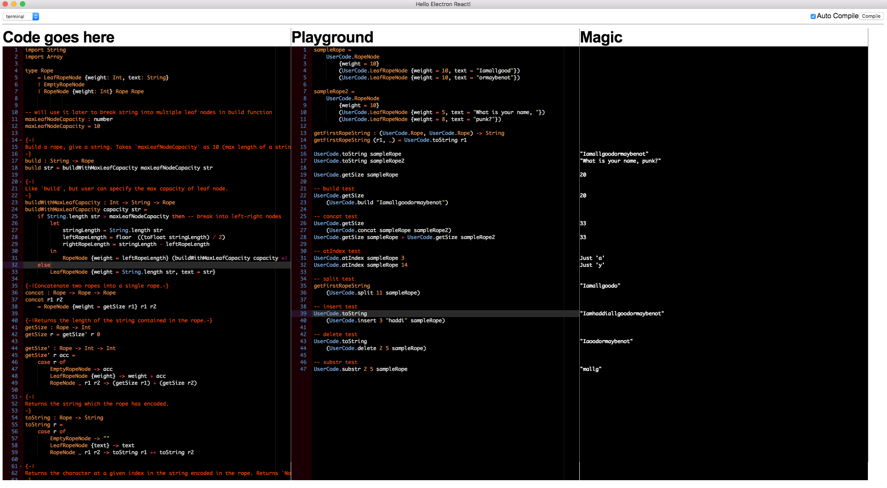
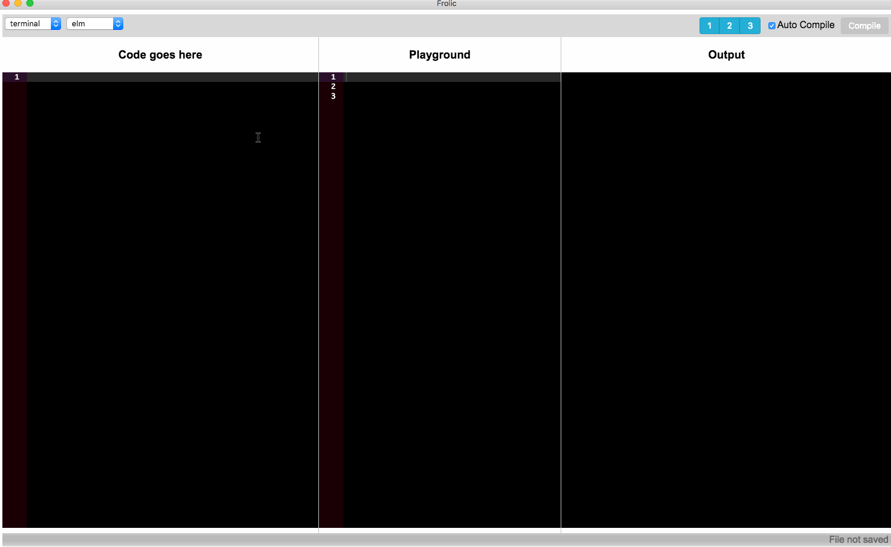

# Frolic

> Learn elm faster and in a fun way




### How to try it out
```
npm run build
npm run start
```

**Notes**
1. Still in heavy development mode. Contributions and feedback are welcome.
2. To test out your ui components just copy whatever you would pass to `main` and call it (in the playground panel) will a function named `render` (also checkout the gif in case of confusion). E.g.
```
render
    { init = init
    , view = view
    , update = update
    , subscriptions = subscriptions
    }
```

### Why frolic
The project was inspired by [haskell for mac](https://haskellformac.com). The main idea is to have a playground panel where users can type out code expressions and see the result instantaneously without any setup. There is a similar thing currently for elm ([elm-lang.org/try](elm-lang.org/try)) but it has limited functionality and doesn't work without having the ui layer (model, view, update, main etc.).

In frolic, you can start typing your expressions and see result in the output panel without any glue code. Plus, it works for ui components too.

### Feature list

- Immediate feedback
- Quick way for someone new to the language to try it out
- Mix of ui components + normal expressions
- Has around 38 packages built in (the list is below). E.g. Just do `import Http` and it will work.
- Can load files from the disk and the dependencies will be resolves automatically
- Having multiple ui components to try out in same output window (like [clojurescript devcards](https://github.com/bhauman/devcards))

### How to setup the dev environment

```
npm install
-- go to folder app/compilers/elm/temp/ and do
elm-package install -y
-- from the root folder run
npm run hot-server
npm run start-hot
```

## Maintainers

- [Mukesh Soni](https://github.com/mukeshsoni)

## License
MIT © [Mukesh Soni](https://github.com/mukeshsoni)
